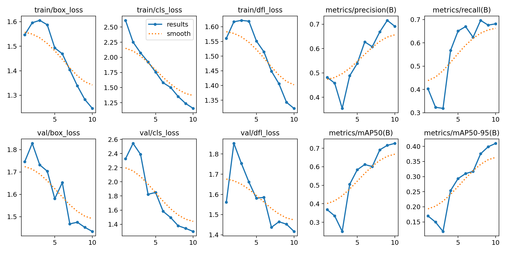
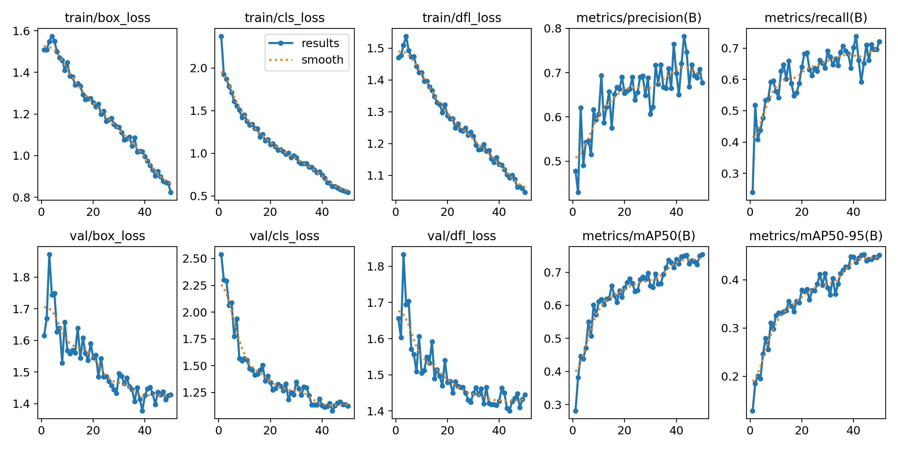

# Pothole Detection using YOLO

This repository contains a deep learning project aimed at automating the detection of potholes on roads using the YOLO (You Only Look Once) object detection architecture. The system is designed to identify and localize road irregularities to assist in infrastructure maintenance and safety monitoring.

## Project Overview

The project utilizes the YOLO model trained on a custom dataset of road imagery. It includes training scripts, evaluation metrics, and inference notebooks to demonstrate the model's capabilities in real-world scenarios.

### Key Features
- **Object Detection:** Real-time detection of potholes in images and video feeds.
- **Custom Training:** Scripts to train YOLO on your own datasets.
- **Performance Analysis:** Detailed comparison between model checkpoints trained for different durations.

## Repository Structure

- `models/`: Contains the trained model weights.
- `results/`: Stores training logs, confusion matrices, and inference results.
- `data.yaml`: Configuration file for the dataset.
- `pothole_detection.ipynb`: Main notebook for training the detection model.
- `predict.ipynb`: Notebook for running inference on new images/videos.
- `video_detection.ipynb`: Notebook specifically for processing video files.

## Installation

To set up the environment and run the code, follow these steps:

1. **Clone the repository:**
   ```bash
   git clone [https://github.com/Sabeer65/pothole-detection-yolo.git](https://github.com/Sabeer65/pothole-detection-yolo.git)
   cd pothole-detection-yolo
   ```

2. **Install dependencies:**
   Ensure you have Python installed. Install the required libraries (assuming YOLOv8/Ultralytics):
   ```bash
   pip install ultralytics opencv-python matplotlib pandas
   ```

## Usage

### Training
To retrain the model, open `pothole_detection.ipynb` and execute the cells. You can adjust the number of epochs in the training configuration.

### Inference
To detect potholes in images or videos:
1. Open `predict.ipynb` or `video_detection.ipynb`.
2. Load your desired model (e.g., the 50-epoch version).
3. Run the inference cells to view results.

## Model Comparison: Version 1 vs Version 2

This project compares two versions of the trained model to demonstrate the impact of training duration on detection accuracy.

### Version 1 (10 Epochs)
- **Training Duration:** Short (10 epochs)
- **Performance:** Fast convergence but lower precision.
- **Observations:** The model detects obvious potholes but often misses smaller or less distinct ones. False positives may be higher.

### Version 2 (50 Epochs)
- **Training Duration:** Extended (50 epochs)
- **Performance:** Significantly improved Mean Average Precision (mAP) and recall.
- **Observations:** The model shows a tighter bounding box fit and is robust against varying lighting conditions and road textures.

### Visual Comparison

| Version 1 (10 Epochs) | Version 2 (50 Epochs) |
| :---: | :---: |
|  |  |
| *Lower confidence scores and missed detections.* | *Higher confidence and accurate localization.* |


## Demo Output

Below is a demonstration of the Version 2 model (50 epochs) processing a video stream.


## License

This project is open-source and available for educational and research purposes.
